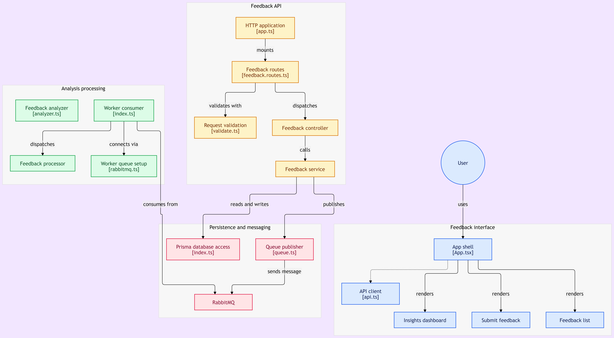
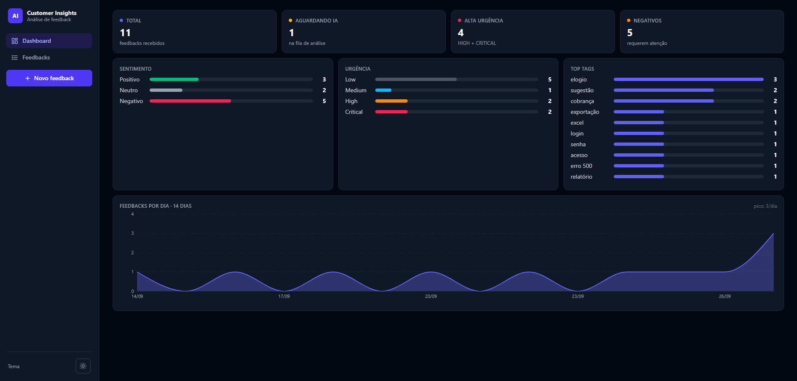

# AI-Powered Customer Insights Platform

Plataforma para coleta e análise automática de feedbacks de clientes. O usuário envia um feedback pelo formulário web, a API o persiste e o encaminha para uma fila de processamento assíncrono, um worker de background o classifica com um modelo de linguagem (sentimento, urgência, categoria, resumo e tags) e o resultado alimenta um dashboard com métricas agregadas e um gráfico de volume.



## Funcionalidades principais

Recepção de feedbacks com validação estrita e resposta imediata, sem aguardar a análise. Classificação automática por IA com saída estruturada, incluindo resumo executivo e tags sugeridas. Acompanhamento do ciclo de vida de cada chamado, dos estados pendente e em processamento até processado ou falho, com fila de mensagens mortas para inspeção de falhas. Dashboard com totais, distribuições por sentimento e urgência, tags mais frequentes e volume dos últimos quatorze dias. Interface web em três telas (dashboard, lista com filtros e paginação, formulário), com modo escuro, navegação lateral e atualização automática. Proteção da API com limitação de requisições, CORS restrito e cabeçalhos de segurança.



## Tecnologias utilizadas

Node.js com TypeScript, Express e Prisma no backend, com MySQL como banco relacional e RabbitMQ como message broker. O worker consome a fila e classifica os textos com o modelo gpt-4o-mini através de gateway compatível com a API da OpenAI. O pacote compartilhado centraliza o schema do banco e o client Prisma em um workspace npm. O frontend é React com Vite, Tailwind CSS e gráficos Recharts. Todo o ecossistema sobe orquestrado por Docker Compose.

## Pré-requisitos

Docker e Docker Compose para a execução completa, ou Node.js 20 com acesso a MySQL 8 e RabbitMQ para execução local dos serviços. Uma chave de API de um provedor compatível com a API da OpenAI para a classificação por IA (o worker também aceita um modo simulado para desenvolvimento sem cota).

## Instalação e configuração

Clone o repositório e copie os arquivos de ambiente, ajustando as senhas e a chave de IA. Os arquivos `.env` nunca são versionados.

```bash
cp .env.example .env
cp backend/.env.example backend/.env
cp worker/.env.example worker/.env
```

As variáveis principais estão detalhadas na seção de variáveis de ambiente. Para desenvolvimento local com npm workspaces, instale as dependências na raiz, gere o client Prisma e aplique as migrations.

```bash
npm install
npm run generate --workspace shared
npm run migrate --workspace shared
```

## Como executar

Para subir o ecossistema completo em um único comando:

```bash
docker compose up --build
```

A aplicação fica disponível no navegador pelo endereço do frontend, e a API responde no endpoint de saúde do backend. Para desenvolvimento, cada serviço pode rodar isoladamente com `npm run dev` dentro de sua pasta, e os testes com `npx vitest run --coverage` no backend e no worker. Um seed com dados de exemplo em português pode ser carregado com `npm run seed --workspace shared`.

## Estrutura de pastas

O diretório `backend` contém a API REST organizada em rotas, controladores e serviços. O `worker` consome a fila e executa a análise por IA. O `shared` centraliza o schema Prisma, as migrations e o client de banco usado pelos dois serviços. O `frontend` contém a aplicação React em telas e componentes. A raiz guarda o Compose, as configurações de lint e o lockfile único do workspace.

## Variáveis de ambiente

A conexão com o banco usa `DATABASE_URL` e com o broker, `RABBITMQ_URL`. Os nomes da fila principal e da dead-letter queue vivem em `FEEDBACK_QUEUE` e `FEEDBACK_DLQ`. A classificação por IA é configurada com `OPENAI_API_KEY`, `OPENAI_MODEL` e, opcionalmente, `OPENAI_BASE_URL` para gateways alternativos. O CORS do backend aceita apenas a origem de `CORS_ORIGIN`, e o frontend aponta para a API via `VITE_API_URL` resolvido em tempo de build. Credenciais do MySQL e do RabbitMQ ficam nas variáveis `MYSQL_*` e `RABBITMQ_*`.

## Contribuição

Contribuições são bem-vindas. Abra uma issue descrevendo a proposta antes de implementações maiores, mantenha o padrão de conventional commits e garanta que build, testes e lint passem nos pacotes afetados. O fluxo de branches usa `main` como estável e `develop` para integração.

## Licença

Este projeto é open source sob a licença MIT e pode ser utilizado para fins comerciais. Veja o arquivo `LICENSE` para o texto completo.
